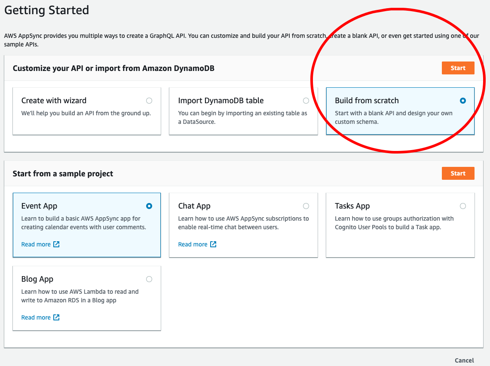
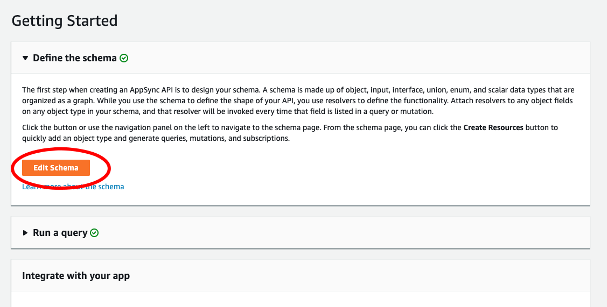
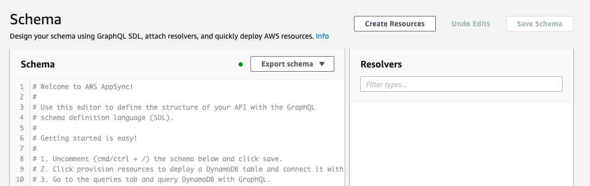
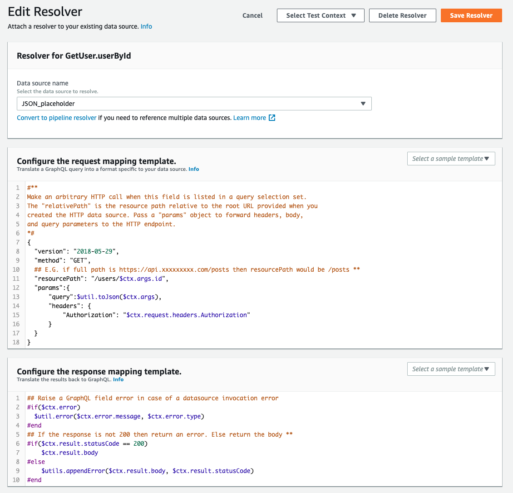
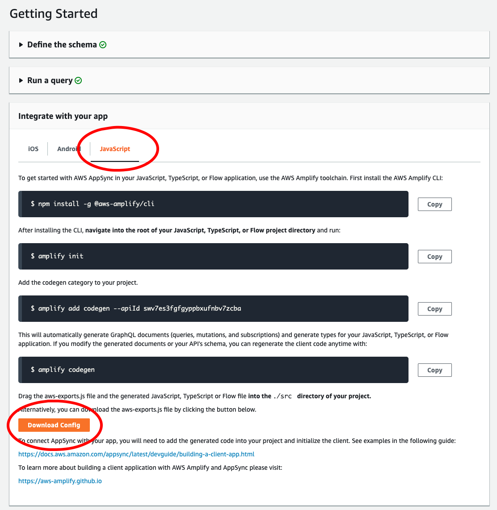
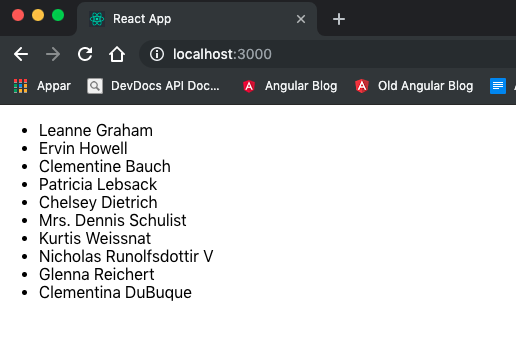

Labba med AppSync
=================

Använd era _ccxxxx\_lambda\_dev_-användare i dessa labbar.

Utvecklarguider för AppSync finns på [AWS AppSync Developer Guide](https://docs.aws.amazon.com/appsync/latest/devguide/welcome.html). Bl.a kan [Resolver Mapping Template Reference](https://docs.aws.amazon.com/appsync/latest/devguide/resolver-mapping-template-reference.html) vara användbar.

Labb 1: Skapa ett API i AWS Console
----------------------------------
I den här labben ska vi bygga ett AppSync-API som är en proxy för [JSON placeholder](https://jsonplaceholder.typicode.com/), vilken är ett fejkat REST-API som finns online.

Logga in på [AWS Management Console](https://293041862718.signin.aws.amazon.com/console).

Eftersom AppSync inte finns i regionen _EU Stockholm_ måste vi byta till regionen _EU Frankfurt_

Gå till meny _Services_ och sök fram _AWS AppSync_.
Här finns en knapp _Create API_, skapa ett nytt _AppSync_ API genom att trycka på knappen _Create API_.

Välj _Build from scratch_ i panelen _Customize your API or import from Amazon DynamoDB_ och tryck på _Start_:


Ge den ett namn som börjar med ditt signum (_ccxxxx_) och gå vidare så öppnas den skapade AppSync-resursen.

Tryck på _Edit Schema_ 


Då öppnas schema-editorn


Definiera följande schema i _Schema_-panelen till vänster:

```graphql
type Address {
	street: String!
	suite: String
	city: String!
	zipcode: String!
	geo: GeographicPositon
}

type Company {
	name: String!
	catchPhrase: String
	bs: String
}

type GeographicPositon {
	lat: Float!
	lng: Float!
}

type GetUser {
	userById(id: ID!): User
	users: [User!]!
}

type User {
	id: ID!
	name: String!
	username: String!
	email: String
	address: Address
	phone: String
	website: String
	company: Company
}

schema {
	query: GetUser
}
```

I panelen _Resolvers_, på högersidan, kan man sedan koppla en _resolver_ till respektive fält i schemat. Nu ska vi koppla en _resolver_ till _userById_-queryn.

Leta fram _GetUser_ och under den _userById(...): User_ och tryck på knappen _Attach_.

Nu måste man lägga till en datakälla och då skall vi lägga till _JSON placeholder_ som datakälla.

Ange *JSON_placeholder* som namn, typen _HTTP endpoint_ samt ange `https://jsonplaceholder.typicode.com` som bas-URL och tryck sedan på _Create_.

När källan är skapad kan man backa tillbaka till resolvern och välja att koppla den nya _JSON_placeholder_-datakällan och sedan skapa _resolvern_.

Nu öppnas en vy där man kan konfigurera anropsmallen (_Configure the request mapping template_):

Denna beskriver hur GraphQL-frågan skall översättas till ett HTTP-anrop. Klicka på _info_-länken för att få information om vad som syns.

Byt värdet för `"resourcePath"` från `"/"` till `"/users/$ctx.args.id"` och spara sedan _resolvern_.

Gör även _Attach_ på queryn _users: [User!]!_. Här behöver man endast sätta `"resourcePath"` till `"/users"`. Spara resolvern.

Hoppa sedan ut till schemat (klicka på schemanamnet i vänstermenyn) och öppna sedan _Run a query_

Lägg till nedanstående fråga i vänstra panelen

```graphql
query GetUser1 {
  userById(id:1) {
    id
    name
  }
}
```

- Kör sedan frågan, vilket skall ge svaret

```
{
  "data": {
    "userById": {
      "id": "1",
      "name": "Leanne Graham"
    }
  }
}
```
- Prova samma sak med 

```graphql
query GetAllUsers {
  users {
    id
    name
  }
}
```

Så, nu har du skapat en GraphQL-proxy, baserad på AppSync, mot ett externt REST-API!

Labb 2: Implementera en React-klient mot AppSync
-----------------------------------------------
Här bygger vi en minimal React-applikation som **inte** bygger på [AWS Amplify](https://aws-amplify.github.io/docs). 

Labben är inspirerad av [Starter App (React)](https://github.com/aws-samples/aws-mobile-appsync-events-starter-react) som finns bland exemplena på [AWS AppSync Resources](https://aws.amazon.com/appsync/resources/).

Vi kommer att bygga en React-applikation från grunden. Applikationen skall lista upp alla användare hämtade från `users` i schemat från föregående labb.

Skapa en React-applikation:

```bash
# Skapa react-applikationen
npx create-react-app my-appsync-client --typescript
cd my-appsync-client
# Installera paket för AWS och GraphQL
npm i -S aws-appsync@2 aws-appsync-react@2 graphql graphql-tag react-apollo@2 
```

För att undvika att man råkar checka in sin API-nyckel är det lämpligt att lägga till `aws-export.*` i `.gitignore` (vi kommer att lägga till filen `aws-export.ts` längre ner).

Nu ska vi först modifiera `src/App.tsx` (vi är lite lata och lägger alla komponenter i en och samma fil) så att vi kopplar ihop den med GraphQL

Börja med att starta applikationen:

```bash
npm start
```

och öppna den i browsern. 

Rensa upp i filen så att `App` blir minimal:

```typescript
import React from 'react';

// Fancy app
const App: React.FC = () => {
  return (
    <div>App is up...</div>
  );
}

// Observera att App är default-export
export default App;

``` 

Nu skall man bara se en sida med texten `App is up...` i browsern.

Ladda ner AppSync-konfigurationsfilen från AWS: Öppna _AWS AppSync_ under _Services_ i _AWS Management Console_. Öppna där schemat du skapade i Labb 1. Öppna fliken _JavaScript_ i panelen _Integrate with your app_: 



Klicka där på knappen _Download Config_ och spara filen i `src`-katalogen i react-applikationen. Den filen anger GraphQL-endpoint, region och API-nyckel för den specifika AppSync-resursen.

Lägg sedan till import av konfigurationen samt initiering av _AWSAppSyncClient_ (vilken kommer att användas nedan för initiering av _Apollo_):

```typescript
import React from 'react'
import awsconfig from './aws-exports.js'
import AWSAppSyncClient, {AUTH_TYPE} from 'aws-appsync/lib'

// Här skapar vi en klient för AWS AppSync
const appSyncClient = new AWSAppSyncClient({
  url: awsconfig.aws_appsync_graphqlEndpoint,
  region: awsconfig.aws_appsync_region,
  auth: {
    type: AUTH_TYPE.API_KEY, // or type: awsconfig.aws_appsync_authenticationType,
    apiKey: awsconfig.aws_appsync_apiKey,
  }
})

// Fancy app
const App: React.FC = () => {
  return (
    <div>App is up...</div>
  )
}

// Observera att App är default-export
export default App
```

Man ser fortfarande sidan med texten `App is up...` i browsern.

Skapa en react-komponent `WithApollo`, vilken kommer att:

- Skapa en Apollo-provider kopplad till _AWSAppSyncClient_ skapad ovanför
- Dessutom lägga till AWS-specifik hantering med `Rehydrated` (instantiering av in-memory-objekt för Apollo-cachen)
- Wrappa `App`	
- Observera att vi nu exporterar `WithApollo` som default, detta innebär att det nu är den komponenten som renderas i `src/index.tsx` istället för `App`
	
```typescript
import React from 'react'
import awsconfig from './aws-exports.js'
import AWSAppSyncClient, {AUTH_TYPE} from 'aws-appsync/lib'
import {ApolloProvider} from 'react-apollo'
import {Rehydrated} from 'aws-appsync-react/lib'

// Här skapar vi en klient för AWS AppSync
const appSyncClient = new AWSAppSyncClient({
  url: awsconfig.aws_appsync_graphqlEndpoint,
  region: awsconfig.aws_appsync_region,
  auth: {
    type: AUTH_TYPE.API_KEY, // or type: awsconfig.aws_appsync_authenticationType,
    apiKey: awsconfig.aws_appsync_apiKey,
  }
})

// Fancy app
const App: React.FC = () => {
  return (
    <div>App is up...</div>
  )
}

// Komponent som kopplar ihop med Apollo och AppSync
const WithApollo: React.FC = () => {
  return (
    <ApolloProvider client={appSyncClient}>
      <Rehydrated>
        <App/>
      </Rehydrated>
    </ApolloProvider>
  )
}

// Observera att vi nu bytt till WithApollo som default-export
export default WithApollo
```

OK, vi har fortfarande inte fått in någon fråga än, men nu blir det plain Apollo: 

- vi lägger till en GraphQL-fråga för att läsa `users`
- dessutom lägger vi till en komponent för att visa resultatet
- till slut kopplar vi ihop komponenten med GraphQL-klienten

```typescript
import React from 'react'
import awsconfig from './aws-exports.js'
import AWSAppSyncClient, {AUTH_TYPE} from 'aws-appsync/lib'
import {ApolloProvider, DataProps, graphql} from 'react-apollo'
import {Rehydrated} from 'aws-appsync-react/lib'
import gql from 'graphql-tag'

// Här skapar vi en klient för AWS AppSync
export const appSyncClient = new AWSAppSyncClient({
  url: awsconfig.aws_appsync_graphqlEndpoint,
  region: awsconfig.aws_appsync_region,
  auth: {
    type: AUTH_TYPE.API_KEY, // or type: awsconfig.aws_appsync_authenticationType,
    apiKey: awsconfig.aws_appsync_apiKey,
  }
})

// GraphQL-query för att läsa users
const usersQuery = gql`query GetUsers {
    users {
        id
        name
    }
}`

// Komponent för att visa users-resultat
const Users: React.FC<Partial<DataProps<any>>> = ({data}) => {
  return (
    <ul>
      {((data && data.users) || []).map((u: any) => (
        <li key={u.id}>{u.name}</li>
      ))}
    </ul>
  )
}

// Koppla ihop komponenten ovan med graphql-klienten
const UsersGraphQL = graphql(usersQuery)(Users)

// Fancy app
const App: React.FC = () => {
  return (
    <div>
      <UsersGraphQL/>
    </div>
  )
}

// Komponent som kopplar ihop med Apollo och AppSync
const WithApollo: React.FC = () => {
  return (
    <ApolloProvider client={appSyncClient}>
      <Rehydrated>
        <App/>
      </Rehydrated>
    </ApolloProvider>
  )
}

// Observera att vi nu bytt till WithApollo som default-export
export default WithApollo
```

Nu skall browsern visa en lista med användare hämtade från AppSync-resursen i backend:



**Wop, du är nu fullfjädrad AppSync-ninja!!!**


